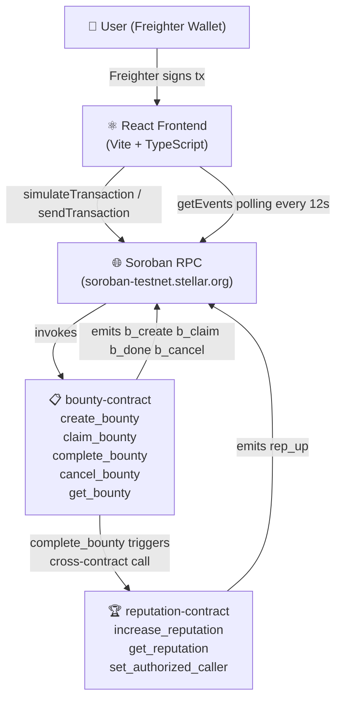

# Stellar Bounty Board

> A decentralized bounty board built on Stellar's Soroban smart contract platform — demonstrating advanced inter-contract communication, real-time event polling, CI/CD, and a production-ready React frontend.

[](https://github.com/N1CK99925/stellar-bounty-board/actions/workflows/ci.yml)

---

## Overview

Stellar Bounty Board lets anyone post a paid task ("bounty"), allows any Stellar wallet holder to claim it, and automatically rewards the claimer with on-chain reputation points when the creator marks it complete. Every action is a real on-chain transaction — no off-chain state or centralised database.

This project was built as a **Stellar Level 3 Orange Belt** submission, focusing on production-style engineering rather than a minimal demo.

---

## Problem

Freelance work and open-source contribution lack transparent, trust-minimized incentive mechanisms. Existing bounty platforms rely on centralised escrow and reputation systems that are opaque, siloed, and vendor-locked.

---

## Solution

Two communicating Soroban smart contracts provide an open, verifiable system:

- **`bounty-contract`** manages the full lifecycle: Open → Claimed → Completed (or Cancelled).
- **`reputation-contract`** tracks on-chain reputation scores. Only the bounty contract can award points — enforced by on-chain access control — ensuring reputation is earned through real work, not self-granted.

---

## Features

- 📋 **Post bounties** — describe a task and set an XLM reward
- 🙋 **Claim bounties** — commit to completing any open bounty
- ✅ **Complete bounties** — creator approves completion, reputation is awarded on-chain
- ❌ **Cancel bounties** — creator can cancel an unclaimed bounty
- 🔗 **Inter-contract calls** — bounty completion triggers a cross-contract reputation update
- 📡 **Event-based polling** — frontend queries Soroban RPC `getEvents` every 12s for real-time state
- 🏆 **On-chain reputation** — tamper-proof score stored on the reputation contract
- 🔒 **Access control** — every mutation requires wallet auth; only the bounty contract can award reputation
- 📱 **Mobile responsive** — works on any screen size
- 🧪 **10 contract tests + 9 frontend tests** — covering success, failure, and access-control paths

---

## Architecture



### Inter-Contract Communication

When `complete_bounty` is called:

1. The bounty contract verifies the caller is the bounty creator
2. It updates the bounty status to `Completed`
3. It makes a **cross-contract call** to `reputation-contract.increase_reputation(claimer, 10)`
4. The reputation contract verifies the caller is the registered authorized caller (the bounty contract address)
5. The claimer's reputation score is incremented on-chain
6. Both contracts emit events

This is on-chain inter-contract communication — not a frontend-simulated interaction.

---

## Tech Stack

| Layer | Technology |
|---|---|
| Smart Contracts | Rust, Soroban SDK 20.3.0 |
| Contract Runtime | Stellar Testnet (Soroban) |
| Frontend | React 18 + TypeScript + Vite |
| Styling | Tailwind CSS |
| Wallet | Freighter (via `@stellar/freighter-api`) |
| Stellar SDK | `@stellar/stellar-sdk` v14 |
| Contract Tests | Soroban native test harness (`cargo test`) |
| Frontend Tests | Vitest + React Testing Library |
| CI/CD | GitHub Actions |
| Deployment | Vercel (frontend), Stellar CLI (contracts) |

---

## Smart Contracts

### `reputation-contract`

Stores a reputation score (u32) per Stellar address. Exposes:

| Function | Access | Description |
|---|---|---|
| `initialize(admin)` | One-time | Sets the admin address |
| `set_authorized_caller(admin, caller)` | Admin only | Registers the one contract allowed to award reputation |
| `increase_reputation(user, points)` | Authorized caller only | Adds points to a user's score |
| `get_reputation(user)` | Anyone | Read-only score lookup |

**Events emitted:** `rep_up` (topic: user address, data: new score)

### `bounty-contract`

Manages the bounty lifecycle. Exposes:

| Function | Access | Description |
|---|---|---|
| `initialize(admin, reputation_contract)` | One-time | Sets admin and wires to reputation contract |
| `create_bounty(creator, id, amount, description)` | Creator (auth) | Creates an Open bounty |
| `claim_bounty(claimer, id)` | Any wallet (auth) | Claims an Open bounty |
| `complete_bounty(creator, id)` | Creator (auth) | Marks Claimed bounty complete; awards reputation |
| `cancel_bounty(creator, id)` | Creator (auth) | Cancels an Open bounty |
| `get_bounty(id)` | Anyone | Read-only bounty lookup |
| `get_claimer(id)` | Anyone | Read-only claimer lookup |

**Events emitted:** `b_create`, `b_claim`, `b_done`, `b_cancel`

---

## Contract Events / Real-Time Updates

Both contracts emit Soroban events on every state change:

| Contract | Event | Emitted When |
|---|---|---|
| bounty-contract | `b_create` | Bounty created |
| bounty-contract | `b_claim` | Bounty claimed |
| bounty-contract | `b_done` | Bounty completed (inter-contract call follows) |
| bounty-contract | `b_cancel` | Bounty cancelled |
| reputation-contract | `rep_up` | Reputation increased |

The frontend uses `server.getEvents()` from `@stellar/stellar-sdk` to query these events and discover new bounties. State is polled every 12 seconds. Pure WebSocket streaming is not yet stable in the Soroban RPC, so event polling is the production-recommended approach at the time of writing.

---

## Security / Authorization

- Every state-changing contract function calls `require_auth()` on the relevant address
- `increase_reputation` is protected by an `authorized_caller` stored on-chain — only the registered bounty contract can invoke it, even if a user tries to call the reputation contract directly
- The frontend never holds private keys; all signing is done inside the Freighter extension
- No secrets are committed to the repository

---

## Testing

### Contract Tests (10 tests across 2 contracts)

Run with: `cargo test --workspace`

| Test | Contract | What it verifies |
|---|---|---|
| `test_full_bounty_lifecycle_rewards_reputation` | bounty | Full Open→Claimed→Completed flow; inter-contract reputation update |
| `test_cannot_claim_already_claimed_bounty` | bounty | Access control: double-claim rejected |
| `test_only_creator_can_complete_bounty` | bounty | Access control: non-creator cannot complete |
| `test_creator_can_cancel_open_bounty` | bounty | Creator can cancel; status set to Cancelled |
| `test_cannot_create_bounty_with_zero_amount` | bounty | Validation: zero amount rejected |
| `test_admin_stored_matches_setup` | bounty | Initialization correctness |
| `test_initialize_sets_admin_once` | reputation | Double-init rejected |
| `test_authorized_caller_can_increase_reputation` | reputation | Reputation accumulates correctly |
| `test_unregistered_caller_cannot_bypass_authorization_state` | reputation | Unauthorized call rejected |
| `test_reputation_defaults_to_zero` | reputation | Fresh addresses start at 0 |

### Frontend Tests (9 tests across 3 files)

Run with: `cd frontend && npm test`

| Test Suite | Coverage |
|---|---|
| `App.test.tsx` | Demo mode banner, connect-wallet button rendering, bounty list display |
| `BountyCard.test.tsx` | Description/amount rendering, claim/complete button behavior, busy state |
| `CreateBountyForm.test.tsx` | Empty description validation, negative amount validation, successful submit |

---

## CI/CD

GitHub Actions runs on every push and pull request to `main`:

1. **Contracts job**: Install Rust 1.81.0 (pinned via `rust-toolchain.toml`), run 10 unit tests, build both contracts to WASM with `stellar contract build`, upload WASM as artifacts
2. **Frontend job**: Install Node 20, run `npm ci`, TypeScript type-check, run 9 tests, build production bundle

---

## Local Setup

### Prerequisites

- Rust (via [rustup](https://rustup.rs/))
- Node.js 18+
- [Freighter wallet extension](https://freighter.app/) (for browser testing)

### Contract tests

```bash
cargo test --workspace
```

All 10 tests run against Soroban's in-process simulator — no network access needed.

### Frontend (demo mode)

```bash
cd frontend
npm install
npm test          # runs the 9 frontend tests
npm run dev       # starts local dev server
```

Without `VITE_BOUNTY_CONTRACT_ID` set, the UI runs in **Demo mode** showing sample data. All UI components are fully functional for screenshots and exploration.

### Frontend (production mode)

```bash
cd frontend
cp .env.example .env
# Edit .env and fill in the contract IDs from deployment
npm run dev
```

---

## Environment Variables

| Variable | Required | Description |
|---|---|---|
| `VITE_SOROBAN_RPC_URL` | No | Soroban RPC endpoint (default: testnet) |
| `VITE_NETWORK_PASSPHRASE` | No | Network passphrase (default: testnet) |
| `VITE_BOUNTY_CONTRACT_ID` | For live mode | Deployed bounty contract address |
| `VITE_REPUTATION_CONTRACT_ID` | For live mode | Deployed reputation contract address |

See [`frontend/.env.example`](frontend/.env.example) for a copy-ready template.

---

## Build Instructions

### Build contracts to WASM

```bash
# Requires stellar-cli: cargo install --locked stellar-cli
./scripts/build.sh
```

### Build frontend

```bash
cd frontend
npm ci
npm run build     # outputs to frontend/dist/
```

---

## Contract Deployment

Full step-by-step: [`docs/DEPLOYMENT.md`](docs/DEPLOYMENT.md)

```bash
# 1. Build
./scripts/build.sh

# 2. Create and fund a testnet identity
stellar keys generate alice --network testnet
stellar keys fund alice --network testnet

# 3. Deploy, initialize, and wire both contracts
./scripts/deploy.sh testnet alice

# 4. Generate a sample transaction (for your submission hash)
./scripts/demo_interaction.sh testnet alice <BOUNTY_CONTRACT_ID> <REPUTATION_CONTRACT_ID>
```

---

## Frontend Deployment (Vercel)

```bash
cd frontend
# Install Vercel CLI once: npm i -g vercel
vercel

# Or connect the GitHub repo at vercel.com/new and set:
# Build Command:    npm run build
# Output Directory: dist
# Environment Variables: VITE_BOUNTY_CONTRACT_ID, VITE_REPUTATION_CONTRACT_ID, etc.
```

A `vercel.json` is included for SPA routing configuration.

---

## Testnet Information

| Network | Value |
|---|---|
| Name | Stellar Testnet |
| RPC URL | `https://soroban-testnet.stellar.org` |
| Network Passphrase | `Test SDF Network ; September 2015` |
| Explorer | [stellar.expert/testnet](https://stellar.expert/explorer/testnet) |
| Friendbot | `https://friendbot.stellar.org?addr=<ADDRESS>` |

---

## Contract Addresses

| Contract | Address |
|---|---|
| bounty-contract | `CDILINO5W2FYL6IDIKUICS7OGYXQWMMUIA2GO4FRI2I4YV5UZQ5FFJYM` |
| reputation-contract | `CDG4TDKVA3L64BNNTF5P754WCDIAYHOROY4GEAISNXWRSOQTEBBLPFPJ` |

---

## Example Transaction

> Verified on-chain lifecycle: create_bounty → claim_bounty → complete_bounty → increase_reputation.

Transaction hash: `f6b6fab4c32c1ca3e7185b17921caf4dbbbf597885678a828516132c577637f1`

View on Explorer: `https://stellar.expert/explorer/testnet/tx/f6b6fab4c32c1ca3e7185b17921caf4dbbbf597885678a828516132c577637f1`

---

## Live Demo

Frontend: `https://stellarbountyboard.netlify.app/`

---

## Demo Video

`<TODO: DEMO_VIDEO_URL>` (1–2 minute walkthrough of wallet connection, bounty lifecycle, inter-contract reputation, and CI pipeline)

---

## Screenshots

> Capture these after deployment. Exact instructions in [`SUBMISSION.md`](SUBMISSION.md).

| Screenshot | Description |
|---|---|
| Mobile UI | `<TODO: screenshot — mobile view of the bounty board>` |
| CI Pipeline | `<TODO: screenshot — GitHub Actions passing all jobs>` |
| Test output | `<TODO: screenshot — 10 contract tests + 9 frontend tests passing>` |

---

## Repository Structure

```
.
├── contracts/
│   ├── bounty/               # Bounty lifecycle contract (Rust / Soroban)
│   │   └── src/
│   │       ├── lib.rs        # Contract implementation
│   │       └── test.rs       # 6 unit tests
│   └── reputation/           # Reputation scoring contract
│       └── src/
│           ├── lib.rs        # Contract implementation
│           └── test.rs       # 4 unit tests
├── frontend/                 # Vite + React + TypeScript app
│   ├── src/
│   │   ├── App.tsx           # Main app, routing, polling, tx lifecycle
│   │   ├── components/       # BountyCard, CreateBountyForm, ErrorBanner, ...
│   │   ├── lib/
│   │   │   ├── contracts.ts  # Soroban tx building, simulation, event polling
│   │   │   ├── wallet.ts     # Freighter wallet connection + tx signing
│   │   │   ├── mockData.ts   # Demo-mode sample data
│   │   │   └── types.ts      # Shared TypeScript types
│   │   └── test/             # 9 frontend tests (Vitest + RTL)
│   ├── .env.example          # Environment variable template
│   └── vercel.json           # Vercel SPA routing config
├── scripts/
│   ├── build.sh              # Build both contracts to WASM
│   ├── deploy.sh             # Deploy, init, and wire contracts on testnet
│   └── demo_interaction.sh   # Scripted create/claim/complete for tx hash
├── docs/
│   ├── ARCHITECTURE.md       # Detailed design notes
│   └── DEPLOYMENT.md         # Step-by-step deployment guide
├── .github/workflows/ci.yml  # GitHub Actions CI pipeline
├── rust-toolchain.toml       # Pinned Rust 1.81.0 for reproducible builds
├── Cargo.toml                # Workspace manifest
├── SUBMISSION.md             # Level 3 submission checklist
└── DEMO_SCRIPT.md            # 1-2 minute demo video script
```

---

## License

MIT — see [LICENSE](LICENSE).
